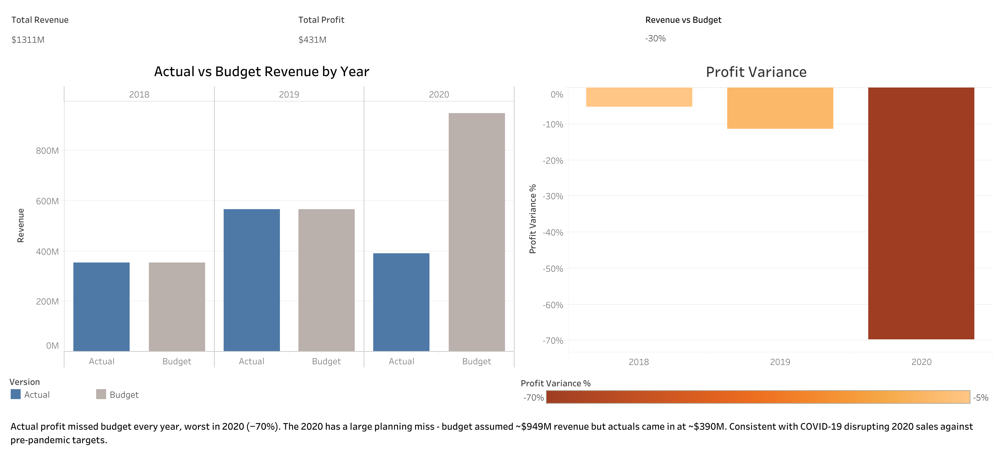
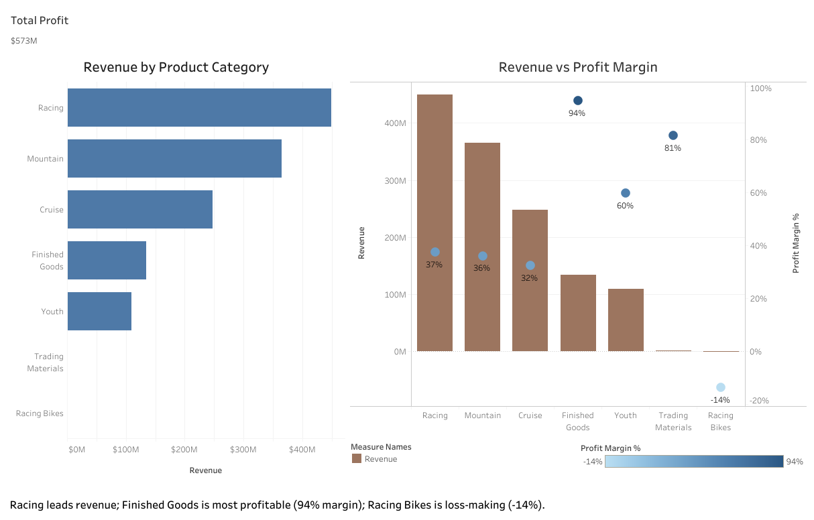
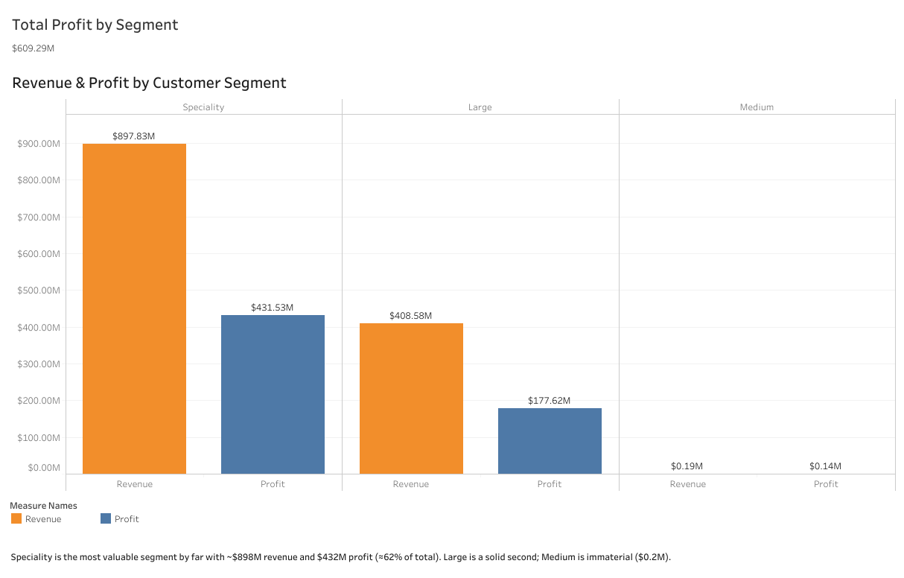

# SAP Financial Analytics — End-to-End Data Pipeline

[](https://public.tableau.com/app/profile/nikolaos.vassakis4731)


> An end-to-end analytics engineering project that takes a raw SAP financial dataset from CSV files all the way to interactive dashboards. Raw data is loaded into PostgreSQL with Python, modelled into a clean star schema with dbt, tested for quality, and visualised in Tableau to answer concrete business questions about revenue, profitability, and customer value.

---

## Overview

The [dataset](https://www.kaggle.com/datasets/radhakrushnadev/financial-dataset-for-sap-datasphere/data) is a sample export from **SAP S/4HANA** that models a fictional bicycle company (Cruise, Mountain, Racing, and Youth bike lines) across roughly three years of financial activity, April 2018 – January 2021.

The project carries this raw export through a full analytics pipeline: Python loads the source CSVs into PostgreSQL as-is, dbt cleans and reshapes them into a tested star schema, and three Tableau dashboards turn the result into a story — how the company performed against budget, which products actually make money, and which customers are worth the most. The thread that stands out is **2020**: actual revenue fell sharply against an optimistic, pre-pandemic budget, a pattern consistent with the COVID-19 demand shock.

---

## Business questions

Three questions drive the whole project, each answered by an interactive dashboard:

- How do actual revenue and profit compare to budget, by year? → [Budget vs Actual](https://public.tableau.com/app/profile/nikolaos.vassakis4731/viz/BudgetvsActualPerformance/Q1)
- Which product category drives the most revenue, and is it profitable? → [Revenue & Profitability by Category](https://public.tableau.com/app/profile/nikolaos.vassakis4731/viz/RevenueProfitabilitybyCategory/Q2)
- Which customer segment generates the most value? → [Value by Customer Segment](https://public.tableau.com/app/profile/nikolaos.vassakis4731/viz/ValuebyCustomerSegment/Q3)

---

## Key findings

### Budget vs Actual


- Revenue grew strongly from **$354M (2018)** to **$567M (2019)**, then fell to **$390M (2020)**.
- In 2018–2019 actual profit tracked reasonably close to budget (within ~5–11%).
- **2020 missed badly**: actual profit of **$122M** against a very ambitious budget of **$403M** — the plan assumed revenue would nearly double, but it declined instead, a pattern consistent with the **COVID-19 hit to sales** against pre-pandemic targets.

### Revenue & profitability by category


- **Racing** is the top revenue driver (**$450M**) and remains solidly profitable (~37% margin).
- **Mountain** is a close second (**$365M**, ~36% margin).
- **Finished Goods** is the margin standout: ~**94% margin** on very low cost — small revenue, outsized profit contribution.
- **Racing Bikes** is the only loss-making category (negligible volume, slightly negative profit).

### Value by customer segment


- **Speciality** dominates: **$898M revenue / $432M profit** — more than double the Large segment on both.
- **Large** is the clear second (**$409M / $178M**).
- **Medium** is effectively immaterial (< $0.2M).

> Revenue is concentrated in a few **Racing/Mountain** categories and overwhelmingly in the **Speciality** segment, while 2020 fell well short of an optimistic budget.

---

## Data model

The grain of the analysis is the financial transaction. Each transaction carries:

| Field | Meaning |
|-------|---------|
| `account_type_id` | `INC` = income/revenue line, `EXP` = expense/cost line |
| `version` | `Actual` (what happened) or `Budget` (what was planned) |
| `customer_type_id` | Customer segment: Large, Speciality, Medium |
| `product_category_id` | Product category: Racing, Mountain, Cruise, Finished Goods, Youth, … |
| `date` | Transaction date (used to build a monthly date dimension) |
| `value` | The monetary amount of the line |

Because revenue and cost live on the same table — distinguished only by `account_type_id` — profit is derived by netting income lines against expense lines. Budget and Actual figures also share the table and are separated by `version`, which is what makes the budget-vs-actual comparison possible.


## Architecture

| Layer | Schema | Built by | Purpose |
|-------|--------|----------|---------|
| **Raw** | `raw` | Python ingestion | CSVs loaded, `#` placeholders converted to NULL |
| **Staging** | `staging` | dbt (`stg_*`, views) | Renamed to snake_case, type-cast (dates, numerics), light cleaning |
| **Marts** | `marts` | dbt (`dim_*`, `fct_*`, tables) | Star schema; fact table `fct_transactions` surrounded by `date` / `category` / `segment` dimensions |
| **Reports** | `marts` | dbt (`rpt_*`) | One model per business question |
| **BI** | — | Tableau |  Dashboards published to Tableau Public |

---

### Repository structure
```
ingestion/load_raw.py          # loading the raw schema from CSVs
sap_dbt/
  models/
    staging/                   # stg_* : cleaning, type-casting
    marts/
      dimensions/              # dim_date, dim_product_category, dim_customer_type
      facts/                   # fct_transactions
      reports/                 # rpt_* : one model per business question
    marts/schema.yml           # tests & descriptions
  macros/generate_schema_name.sql
data/exports/                  # report outputs feeding Tableau
docs/images/                   # dashboard screenshots used in this README
```

---

## License

MIT License
